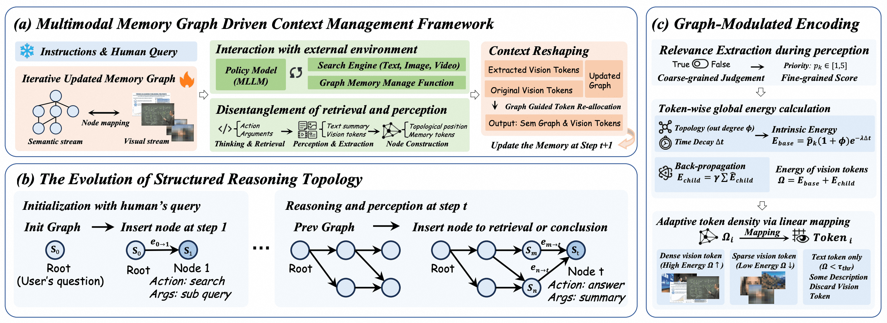
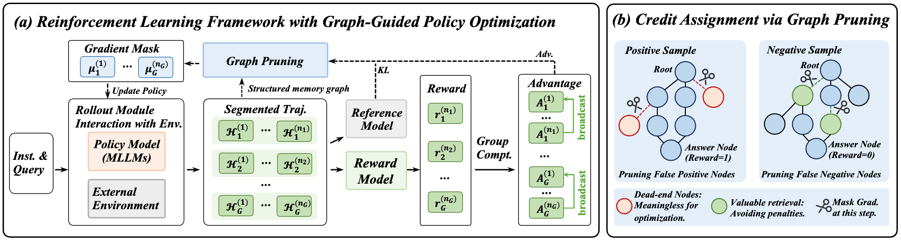

# <div align="center">✨Moving Towards Next-Generation RAG via Multi-Modal Agentic Reinforcement Learning</div>

<div align="center">
<p><strong>A Multi-Turn Multi-Modal Agent Training Framework</strong></p>
<a href="https://arxiv.org/pdf/2602.12735v1" target="_blank"></a>
<a href="https://arxiv.org/pdf/2505.22019" target="_blank"></a>
<br>
<a href="https://huggingface.co/collections/Alibaba-NLP/vrag" target="_blank"></a>
<a href="https://huggingface.co/datasets/Qiuchen-Wang/ViDoSeek" target="_blank"></a>
<a href="https://huggingface.co/Qiuchen-Wang/Qwen2.5-VL-7B-VRAG" target="_blank"></a>
</div>

---

<div align="center">
<p align="center">
  
</p>
</div>

---

## 📑 Table of Contents

- [✨Moving Towards Next-Generation RAG via Multi-Modal Agentic Reinforcement Learning](#moving-towards-next-generation-rag-via-multi-modal-agentic-reinforcement-learning)
  - [📑 Table of Contents](#-table-of-contents)
  - [🔥 News](#-news)
  - [🚀 Overview \& New Feature](#-overview--new-feature)
  - [⚙️ Dependencies](#️-dependencies)
  - [🚀 Quick Start](#-quick-start)
    - [One-Command Launch](#one-command-launch)
  - [🔍 Build Your Own Retriever](#-build-your-own-retriever)
    - [Step 1: Prepare Corpus](#step-1-prepare-corpus)
    - [Step 2: Build Index](#step-2-build-index)
    - [Step 3: Start Search Engine API](#step-3-start-search-engine-api)
  - [💻 Run Demo](#-run-demo)
    - [VimRAG Demo (Recommended)](#vimrag-demo-recommended)
    - [VRAG Demo (Local Model)](#vrag-demo-local-model)
  - [⚙️ Model Training](#️-model-training)
    - [VRAG-RL](#vrag-rl)
    - [VimRAG](#vimrag)
  - [📁 Project Structure](#-project-structure)
  - [🙏 Acknowledgments](#-acknowledgments)
  - [📝 Citation](#-citation)
  - [🔗 Related Projects](#-related-projects)

---

## 🔥 News

- ⏳ The project is still under ongoing development, and the training code of VimRAG will be available after being reviewed by the company.
- 🎉 We have released the report of the **VimRAG**.
- 🎉 We have released the retriever based on FAISS, enabling retrieval with [GVE embedding](https://huggingface.co/Alibaba-NLP/GVE-7B) and [Qwen3-VL-Embedding](https://github.com/QwenLM/Qwen3-VL-Embedding).
- 🎉 We have released the demo of **VRAG-RL**, allowing you to customize your own VRAG.
- 🎉 Our framework integrates SOTA visual embedding models, enabling you to create your own retriever.

---

## 🚀 Overview & New Feature

- We introduce **VimRAG**, a novel framework tailored for multimodal Retrieval-Augmented Reasoning across text, images, and videos.
- We propose the Multimodal Memory Graph and Graph-Guided Policy Optimization, modeling the reasoning process as a dynamic directed acyclic graph, and by pruning memory nodes associated with redundant actions, GGPO enables fine-grained credit assignment and accelerates training convergence.
- We introduce **VRAG**, a purely visual RAG agent that enables VLMs to progressively gather information from a coarse-grained to a fine-grained perspective.
- We have released the **training framework** of VRAG-RL, a novel multi-turn and multimodal training framework with strong extensibility, capable of supporting training with various tools.


## ⚙️ Dependencies
```bash
# Create environment
conda create -n vrag python=3.10
# Clone project
git clone https://github.com/alibaba-nlp/VRAG.git
cd VRAG
# Install dependencies for demo and retriever
pip install -r requirements.txt
```

## 🚀 Quick Start

**Please refer to `run_demo.sh` to quickly start the demo.** Below is a step-by-step guide to help you run the demo on our example data.

### One-Command Launch

```bash
# VimRAG (API-based, recommended for quick start)
export DASHSCOPE_API_KEY=your_api_key
./run_demo.sh vimrag
# VRAG (Local model, requires A100 80G)
./run_demo.sh vrag
# Search engine only
./run_demo.sh search
```

---

## 🔍 Build Your Own Retriever

### Step 1: Prepare Corpus

**Images**: Place image files directly in the corpus directory:
```bash
cp /path/to/your/images/*.jpg search_engine/corpus/image/
```

**PDFs**: Convert PDF documents to images:
```bash
mkdir -p search_engine/corpus/pdf
cp /path/to/your/documents/*.pdf search_engine/corpus/pdf/
python search_engine/corpus/pdf2images.py
```

**Videos**: Split long videos into smaller chunks:
```bash
./search_engine/corpus/splitVideo.sh -i /path/to/videos -o search_engine/corpus/video -d 60
```

### Step 2: Build Index

**Supported Embedding Models:**

| Model | Dimension | Notes |
|-------|-----------|-------|
| `Alibaba-NLP/GVE-3B` | 2048 | Qwen2.5-VL-based embedding |
| `Alibaba-NLP/GVE-7B` | 3584 | Higher quality, more VRAM |
| `Qwen/Qwen3-VL-Embedding-2B` | 2048 | Qwen3-VL-based embedding |
| `Qwen/Qwen3-VL-Embedding-8B` | 4096 | Higher quality, more VRAM |

**Build the Index:**
```python
from search_engine.search_engine import SearchEngine

# Initialize with your chosen embedding model
engine = SearchEngine("/path/to/Qwen3-VL-Embedding-2B")

# Build index from your corpus
engine.build_index(
    input_dir="search_engine/corpus/image",
    index_output_path="search_engine/corpus/image_index",
    corpus_output_path="search_engine/corpus/image_index",
    bs=16  # Adjust based on memory
)
```

> **Note:** The index is automatically saved periodically. If interrupted, re-running will resume from the last checkpoint.

### Step 3: Start Search Engine API

Edit `search_engine/search_engine_api.py` to configure paths:
```python
model_path = "/path/to/your/embedding/model"
corpus_path = ["search_engine/corpus/image_index"]
```

Launch the API server:
```bash
python search_engine/search_engine_api.py
```

Test the endpoint:
```bash
curl -X POST http://localhost:8001/search \
    -H "Content-Type: application/json" \
    -d '{"queries": ["your search query"], "top_k": 3}'
```

---

## 💻 Run Demo

### VimRAG Demo (Recommended)

VimRAG uses Qwen3.5-Plus via DashScope API — no local GPU required for model inference.

<div align="center">

</div>

**Features:**
- Real-time DAG visualization of reasoning process
- Multimodal memory graph
- Extended thinking mode
- Streaming output

**Launch:**
```bash
export DASHSCOPE_API_KEY=your_api_key
./run_demo.sh vimrag
```

**Manual Launch:**
```bash
# Terminal 1: Start search engine
python search_engine/search_engine_api.py

# Terminal 2: Launch Streamlit demo
streamlit run demo/vimrag_app.py
```

**Configuration Options:**

| Option | Default | Description |
|--------|---------|-------------|
| API Base URL | `https://dashscope.aliyuncs.com/compatible-mode/v1` | DashScope Qwen API endpoint |
| Search Engine URL | `http://localhost:8001/search` | Local search engine endpoint |
| Model | `qwen3.5-plus` | Model to use (supports multimodal reasoning) |
| Max Steps | `20` | Maximum reasoning iterations |
| Search Top-K | `3` | Number of results per search |

**Programmatic Usage:**
```python
import os
from demo.vimrag_agent import VimRAG

agent = VimRAG(
    base_url="https://dashscope.aliyuncs.com/compatible-mode/v1",
    search_url="http://localhost:8001/search",
    model_name="qwen3.5-plus",
    api_key=os.environ.get("DASHSCOPE_API_KEY"),
    enable_thinking=True
)

for event in agent.run({"query": "Your question here"}):
    if event["event"] == "answer":
        print(event["content"])
```

### VRAG Demo (Local Model)

<div align="center" style="background-color: #f0f0f0; padding: 5px; border-radius: 5px;">
  <table style="border-collapse: collapse; margin: 0 auto;">
    <tr>
      <td style="padding: 5px;">
        
      </td>
      <td style="padding: 5px;">
        
      </td>
      <td style="padding: 5px;">
        
      </td>
    </tr>
  </table>
</div>

<https://github.com/user-attachments/assets/6d9bd7af-4ad9-4804-910b-2b2c5b2e0c35>

<https://github.com/user-attachments/assets/22c90e3e-ec04-4967-9bb9-52d8c1ebd410>


VRAG uses a locally deployed Qwen2.5-VL-7B model via vLLM.

**Launch:**
```bash

./run_demo.sh vrag
```

**Manual Launch:**
```bash
# Terminal 1: Start search engine (port 8001)
python search_engine/search_engine_api.py

# Terminal 2: Start vLLM server (port 8002)
vllm serve autumncc/Qwen2.5-VL-7B-VRAG \
    --port 8002 \
    --host 0.0.0.0 \
    --limit-mm-per-prompt image=10 \
    --served-model-name Qwen/Qwen2.5-VL-7B-Instruct

# Terminal 3: Launch Streamlit demo
streamlit run demo/app.py
```

**Programmatic Usage:**
```python
from demo.vrag_agent import VRAG

vrag = VRAG(
    base_url="http://0.0.0.0:8002/v1",
    search_url="http://0.0.0.0:8001/search",
    generator=False,
    api_key="EMPTY"
)

answer = vrag.run("Your question here")
```

---

## ⚙️ Model Training

### VRAG-RL

Training code for VRAG-RL is available in the `VRAG-RL/` directory.

**Installation:**
```bash
cd VRAG-RL
pip install -e .
pip install -r requirements_train.txt
```

**Start Training:**
```bash
./train_grpo_qwen2_5_vl_7b.sh
```

<div align="center">

</div>

See [`VRAG-RL/README.md`](VRAG-RL/README.md) for detailed training instructions.

### VimRAG

> **Note:** VimRAG training code (Qwen3-VL) will be released after company review.

<div align="center">

</div>


---

## 📁 Project Structure

```
VRAG/
├── demo/                      # Demo applications
│   ├── app.py                 # VRAG Streamlit demo
│   ├── vimrag_app.py          # VimRAG Streamlit demo
│   ├── vrag_agent.py          # VRAG agent implementation
│   └── vimrag_agent.py        # VimRAG agent implementation
├── search_engine/             # Multimodal retrieval engine
│   ├── models/                # Embedding models (GVE, Qwen3-VL)
│   ├── corpus/                # Corpus and index storage
│   ├── search_engine.py       # Core search engine
│   └── search_engine_api.py   # FastAPI server
├── VRAG-RL/                   # RL training framework
│   ├── verl/                  # Training infrastructure
│   ├── vrag_agent/            # Agent for training
│   └── train_grpo_qwen2_5_vl_7b.sh
├── assets/                    # Images and demos
├── requirements.txt           # Dependencies
└── run_demo.sh                # Launch script
```

---

## 🙏 Acknowledgments

This work is implemented based on [ViDoRAG](https://github.com/Alibaba-NLP/ViDoRAG), [LLaMA-Factory](https://github.com/hiyouga/LLaMA-Factory), [Search-R1](https://github.com/PeterGriffinJin/Search-R1), and [verl](https://github.com/volcengine/verl). We greatly appreciate their valuable contributions to the community.

---

## 📝 Citation

```bibtex
@article{wang2025vrag,
  title={Vrag-rl: Empower vision-perception-based rag for visually rich information understanding via iterative reasoning with reinforcement learning},
  author={Wang, Qiuchen and Ding, Ruixue and Zeng, Yu and Chen, Zehui and Chen, Lin and Wang, Shihang and Xie, Pengjun and Huang, Fei and Zhao, Feng},
  journal={arXiv preprint arXiv:2505.22019},
  year={2025}
}

@article{wang2026vimrag,
  title={VimRAG: Navigating Massive Visual Context in Retrieval-Augmented Generation via Multimodal Memory Graph},
  author={Wang, Qiuchen and Wang, Shihang and Zeng, Yu and Zhang, Qiang and Zhang, Fanrui and Guo, Zhuoning and Zhang, Bosi and Huang, Wenxuan and Chen, Lin and Chen, Zehui and others},
  journal={arXiv preprint arXiv:2602.12735},
  year={2026}
}
```

---

## 🔗 Related Projects

Explore our additional research on Visual Retrieval-Augmented Generation:

[](https://github.com/Alibaba-NLP/ViDoRAG) [](https://github.com/Alibaba-NLP/ViDoRAG)

**ViDoRAG**: Visual Document Retrieval-Augmented Generation via Dynamic Iterative Reasoning Agents. A novel RAG framework that utilizes a multi-agent, actor-critic paradigm for iterative reasoning, enhancing the noise robustness of generation models.

---

<div align="center">
<sub>Made with ❤️ by Alibaba NLP</sub>
</div>
  
   
