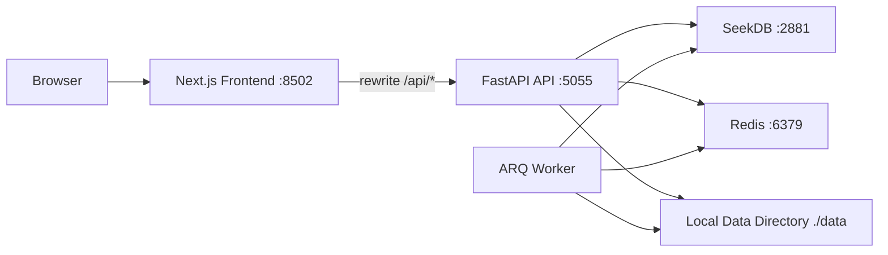
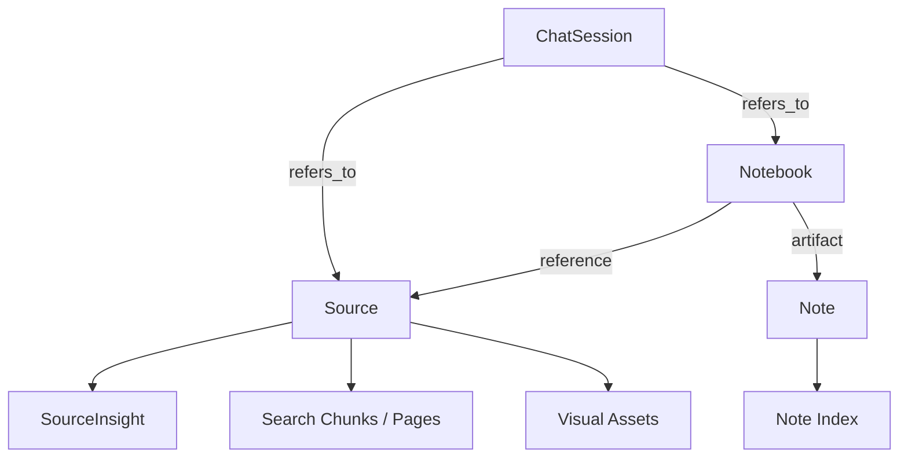
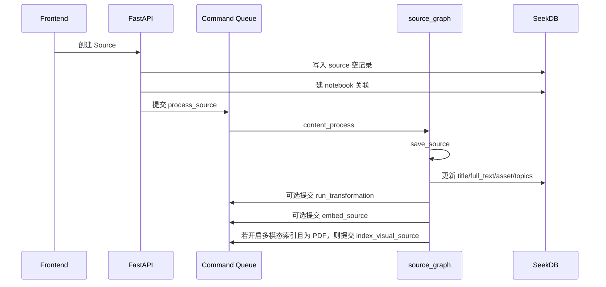
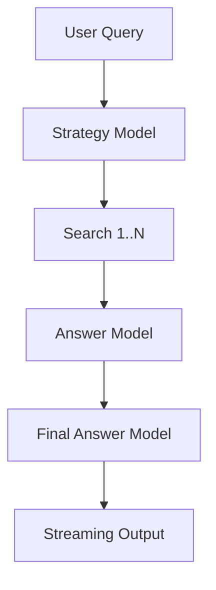

# Open Notebook 软件规格说明书

- 文档性质：基于当前仓库源码整理的现状规格说明
- 基线版本：`open-notebook 1.8.1`
- 基线日期：`2026-04-18`
- 覆盖范围：`frontend/`、`api/`、`open_notebook/`、`commands/`、`tests/`

本文描述的是当前代码已经实现的系统能力、接口、数据结构和运行约束。它不是路线图，也不覆盖尚未落地的设想。

## 1. 文档范围

本文回答四件事：

1. 系统现在由哪些模块组成。
2. 系统现在已经提供哪些功能。
3. 这些功能依赖哪些数据结构、后台流程和接口。
4. 当前实现有哪些边界、兼容层和运行约束。

本文不展开的内容：

- 每个第三方库的内部实现
- 部署平台的外部网关、证书、监控体系
- 尚未进入主干代码的规划性功能

## 2. 产品定义

Open Notebook 是一套自托管的 AI 研究工作台。

它把资料采集、知识整理、检索问答、资料变换、播客生成和视觉检索放进同一套系统里。系统围绕几个核心对象展开：

- `Notebook`：研究主题或项目容器
- `Source`：资料源，可来自链接、上传文件或直接输入文本
- `Note`：用户或 AI 生成的笔记
- `Transformation`：作用在资料上的提示模板
- `ChatSession`：面向 notebook 或 source 的会话
- `Credential` / `Model`：AI 提供商凭据和模型注册记录
- `EpisodeProfile` / `SpeakerProfile` / `Episode`：播客模板和播客结果
- `Visual Asset` / `Visual RAG Session`：视觉索引和视觉问答状态

## 3. 产品目标与当前边界

### 3.1 目标

- 把研究资料集中在一个工作区里管理。
- 允许同一份资料复用到多个 notebook。
- 支持文本检索、向量检索和基于检索的问答。
- 支持对资料执行可配置的 AI transformation，并把结果沉淀为洞察或笔记。
- 支持基于资料生成播客。
- 支持对 PDF 的页面图和图片做视觉检索与多步问答。
- 支持多 AI provider、多模型槽位和自托管部署。

### 3.2 当前边界

- 当前是单工作区、单共享密码形态，没有用户体系、角色体系和多租户隔离。
- 认证只有一个全局密码开关，没有用户级 token、会话续期和权限矩阵。
- Visual RAG 的 canonical 索引器当前只对 PDF 建视觉索引。
- 聊天消息正文不保存在 `chat_session` 表，而是保存在 LangGraph checkpoint 相关表中。
- 搜索和 AI 配置的主后端默认都是 SeekDB，仓库中仍保留部分旧索引结构和兼容路径。

## 4. 运行架构

### 4.1 架构分层

| 层 | 主要目录 | 职责 |
| --- | --- | --- |
| 前端展示层 | `frontend/src/app`、`frontend/src/components` | 页面、工作台交互、SSE 消费、运行时配置读取 |
| HTTP 接口层 | `api/main.py`、`api/routers/*.py` | 路由、请求校验、响应组装、错误映射 |
| 领域层 | `open_notebook/domain/*.py` | 业务实体、核心对象行为、关联关系 |
| 工作流层 | `open_notebook/graphs/*.py`、`open_notebook/vrag/*` | 资料处理、聊天、Ask、视觉问答的 LangGraph 编排 |
| 命令层 | `commands/*.py`、`open_notebook/jobs/*` | 后台任务注册、排队、执行、重试、取消 |
| 存储层 | `open_notebook/seekdb/*`、`open_notebook/storage/*` | 业务表、检索索引、视觉资产、工作流持久化 |

### 4.2 代码组织

| 模块 | 目录 | 现状职责 |
| --- | --- | --- |
| 前端页面 | `frontend/src/app` | 路由页、布局、服务端配置桥接 |
| 前端通用组件 | `frontend/src/components` | Notebook 三栏、Source 详情、Chat、Visual RAG、命令面板 |
| API 路由 | `api/routers` | Notebook、Source、Note、Chat、Search、Models、Credentials、Podcasts、Visual RAG 等接口 |
| API 模型 | `api/models.py` | Pydantic 请求和响应模型 |
| 启动入口 | `api/main.py` | FastAPI app、CORS、中间件、迁移、路由注册 |
| 领域对象 | `open_notebook/domain` | Notebook、Source、Note、Transformation、Credential 等实体 |
| AI 运行时 | `open_notebook/ai` | provider catalog、provider runtime、模型 provision |
| SeekDB 访问 | `open_notebook/seekdb` | schema、business store、retrieval、配置管理 |
| 工作流 | `open_notebook/graphs` | notebook chat、source chat、Ask、prompt、source processing、transformation |
| 命令与任务 | `commands`、`open_notebook/jobs` | 任务注册、队列适配、worker、命令存储 |
| 文件与视觉资产 | `open_notebook/storage` | 文件路径、视觉资产索引、Visual RAG 会话存储 |

### 4.3 推荐部署形态

从 `docker-compose.yml` 和 `docker-compose.dev.yml` 看，推荐的运行形态是三服务：

- `open_notebook`：同时提供前端 `8502` 和 API `5055`
- `seekdb`：业务存储、检索索引、LangGraph checkpoint 存储，默认 `2881`
- `redis`：后台任务队列后端，默认 `6379`

前端通过 Next.js rewrite 把 `/api/*` 请求转到 FastAPI，所以对外暴露时通常只需要入口站点。浏览器端实际使用的 API 地址由 `/config` 运行时端点提供，可来自 `API_URL`，也可根据请求头自动推断。

### 4.4 启动阶段行为

API 启动阶段会执行这些动作：

1. 读取环境变量和 `_FILE` 形式的密钥文件配置。
2. 初始化 FastAPI、CORS、认证中间件和路由。
3. 运行数据库迁移。
4. 运行播客 profile 兼容迁移。
5. 初始化 SeekDB schema。
6. 执行 Visual RAG 旧数据迁移。
7. 根据环境变量决定是否自动回填视觉索引。
8. 输出系统可用状态，供 `/health` 和 `/api/config` 查询。

## 5. 技术栈

### 5.1 后端

- Python `>=3.11,<3.13`
- FastAPI
- Pydantic v2
- LangChain / LangGraph
- Esperanto 生态 provider 适配层
- content-core 内容抽取
- podcast-creator 播客生成
- SeekDB Python 客户端
- Redis + ARQ

### 5.2 前端

- Next.js `^16.1.5`
- React `^19.2.3`
- TypeScript `^5`
- TanStack Query `^5.83.0`
- Tailwind CSS `^4`
- Radix UI / shadcn-ui 组件
- i18next

## 6. 核心对象与关系

### 6.1 核心对象

| 对象 | 作用 | 关键字段或状态 |
| --- | --- | --- |
| `Notebook` | 研究容器 | `name`、`description`、`archived` |
| `Source` | 资料源 | `title`、`asset`、`full_text`、`topics`、`command` |
| `Note` | 笔记 | `title`、`content`、`note_type` |
| `SourceInsight` | 资料洞察 | `insight_type`、`content` |
| `Transformation` | 提示模板 | `name`、`description`、`prompt`、`apply_default` |
| `ChatSession` | 会话元数据 | `title`、`model_override` |
| `Credential` | provider 凭据 | `provider`、加密后的敏感字段 |
| `Model` | 模型注册记录 | `provider`、`model_name`、`model_type`、`credential_id` |
| `EpisodeProfile` | 播客内容模板 | 语言、段落数、outline/transcript 模型 |
| `SpeakerProfile` | 说话人模板 | 1 到 4 个 speaker、voice model、voice id |
| `Episode` | 播客产物 | `outline`、`transcript`、`audio_file`、`command` |
| `VisualAsset` | 视觉索引项 | 页面图、原生图、摘要、bbox、embedding |
| `VisualRAGSession` | 视觉问答会话 | 会话元数据、事件流、状态快照 |

### 6.2 对象关系

### 6.3 需要单独说明的关系

- `Source` 可以关联多个 `Notebook`。`reference` 关系是多对多，不是独占归属。
- `Note` 通过 `artifact` 关联到 `Notebook`。
- `ChatSession` 既可关联 `Notebook`，也可关联 `Source`，二者都走 `refers_to` 关系。
- 聊天消息不在 `ChatSession` 表里。`ChatSession` 只存会话元数据，消息和 checkpoint 在 `langgraph_*` 表里。
- `default_vision_model` 是一个独立的默认槽位，但当前模型表里没有单独的 `vision` 模型类型；视觉槽位复用 `language` 类型模型记录。

## 7. 功能规格

## 7.1 认证与系统初始化

### 已实现功能

- 支持通过 `OPEN_NOTEBOOK_PASSWORD` 启用全局密码认证。
- 鉴权方式是 Bearer Token，请求头里直接携带共享密码。
- `/api/auth/status` 返回认证是否启用。
- 前端登录页先探测认证状态；未启用认证时直接进入主工作台。

### 运行约束

- 没有用户注册、用户登录态、权限分级和审计轨迹。
- 开启认证后，业务 API 都需要 Bearer 密码。
- 未配置 `OPEN_NOTEBOOK_ENCRYPTION_KEY` 时，不允许新增或更新凭据记录。

## 7.2 Notebook 管理

### 已实现功能

- 创建 notebook
- 获取 notebook 列表
- 按 `archived` 过滤活动和归档 notebook
- 模糊搜索 notebook
- 获取 notebook 明细
- 更新名称、描述、归档状态
- 删除前预览影响范围
- 删除 notebook

### 删除语义

删除 notebook 时，系统会区分两类对象：

- `Note`：总是删除
- `Source`：可选择删除仅属于当前 notebook 的独占 source；共享 source 默认只解除关联

删除预览接口会返回至少这些统计：

- `note_count`
- `exclusive_source_count`
- `shared_source_count`

### 前端形态

- `/notebooks`：活动 / 归档列表
- `/notebooks/[id]`：桌面端三栏工作台，移动端 tab 形态
- `/notebooks/[id]/visual`：该 notebook 的 Visual RAG 工作区

### Notebook 工作台的当前交互

- 左栏展示 source 列表
- 中栏展示聊天和上下文选择
- 右栏展示 note 列表
- 对每个 source 和 note 都可以配置是否进入当前问答上下文
- source 的默认上下文模式是：有 insight 时优先 `insights`，否则 `full`
- note 的默认上下文模式是 `full`

## 7.3 Source 采集与处理

### 输入方式

`SourceCreate` 当前支持三种输入模式：

- `type=link`
- `type=upload`
- `type=text`

### 内容抽取边界

- 具体文件解析、网页抓取和文本抽取交给 `content-core`。
- 当前代码保证的是录入模式和后续流程，不把每一种格式写成独立 API。
- 文件格式、网页可抓取性和抽取质量，依赖 `content-core` 和内容处理设置。

### 关联能力

- 创建 source 时可直接关联多个 notebook
- 已有 source 可追加关联到其他 notebook
- 可从某个 notebook 中解除 source 关联，而不删除全局 source

### 处理模式

- 同步处理：API 在超时控制下直接执行处理流程
- 异步处理：先创建 source 记录，再提交后台命令
- 可选执行 transformation 列表
- 可选提交 embedding
- 可选触发 Visual RAG 索引
- 处理失败后支持 retry

### 当前处理流程

### Source 详情页已实现的能力

- 编辑标题
- 编辑 topics
- 查看处理状态
- 查看洞察列表
- 触发新的 transformation
- 删除洞察
- 将洞察保存为 note
- 手动触发 embedding
- 手动触发 Visual RAG 重新索引
- 下载原始上传文件
- 查看和调整 notebook 归属
- 发起单资料聊天

### Source 删除语义

删除 source 时，系统会做清理：

- 删除上传原文件
- 删除 source embedding / chunk / page 索引
- 删除 source insight
- 删除视觉资产
- 删除 SeekDB 中的检索索引项

下载原文件时会校验解析后的文件路径必须仍位于 `UPLOADS_FOLDER` 之下，避免越界读取。

## 7.4 Insight 与 Transformation

### Transformation 管理

- 创建、查询、更新、删除 transformation
- 管理默认 transformation prompt 前缀
- 在 playground 中对任意文本执行 transformation

### Insight 管理

- 查询 source 下的 insight 列表
- 删除 insight
- 将 insight 保存成 note
- 围绕既有 source 异步生成新的 insight

### 执行方式

- `POST /api/transformations/execute`：对给定文本直接执行 transformation
- `POST /api/sources/{source_id}/insights`：对既有 source 异步执行 transformation

### 当前行为特征

- source 的 transformation 走后台命令 `run_transformation`
- transformation 产物落为 `SourceInsight`
- insight 保存为 note 后，会进入 note 的常规生命周期和 embedding 流程

## 7.5 Note 管理

### 已实现功能

- 创建、查询、更新、删除 note
- 按 notebook 过滤 note
- 把 note 关联到 notebook
- 区分 `human` / `ai` 两类 note
- AI note 在未提供标题时自动生成标题
- 保存或更新 note 后异步提交 embedding

### 当前行为

- note 删除时会清理 note 的检索索引
- notebook 工作台右栏负责 note 的日常创建、编辑、删除
- Chat 回复和 insight 都能下沉为 note

## 7.6 Notebook Chat

### 会话管理

- 获取 notebook 下的会话列表
- 创建会话
- 获取会话详情和消息
- 更新标题
- 设置会话级模型覆盖
- 删除会话

### 上下文管理

前端可以为每个 source 和 note 设置上下文进入方式：

- Source：`off` / `insights` / `full`
- Note：`off` / `full`

`/api/chat/context` 会把前端的选择集转换为真正的上下文，并返回：

- `context`
- `token_count`
- `char_count`

### 运行方式

- 非流式：`POST /api/chat/execute`
- 流式：`POST /api/chat/execute/stream`

### 实际执行逻辑

1. 后端先从请求里解析 scope。
2. 如果未指定 scope，则回退到 notebook 下全部 source 和 note。
3. `build_multimodal_evidence()` 负责检索增强，补齐文本证据、页面证据和引用信息。
4. `chat_graph` 调用模型生成回复。
5. 会话消息和 checkpoint 由 `SeekDBSaver` 写入 `langgraph_*` 表。

### 当前约束

- `chat_session` 表不保存消息正文。
- 消息读取依赖 LangGraph checkpoint 存储可用。
- 单次问答可以显式指定模型，也可以继承会话级模型覆盖。

## 7.7 Source Chat

### 已实现功能

- source 级 chat session 的增删改查
- 会话级模型覆盖
- SSE 流式问答
- 返回本次回复命中的 `context_indicators`

### 与 Notebook Chat 的区别

- 作用域固定在单个 source
- 默认使用该 source 的正文和其 insight
- 会话元数据仍存放在 `chat_session`
- 通过 `refers_to -> source` 与 notebook 会话区分

## 7.8 Search

### 已实现检索类型

`/api/search` 当前支持：

- `type=text`
- `type=vector`

### 当前检索范围

检索时可以控制是否搜索：

- source
- note
- insight

视觉相关查询还能优先命中带视觉摘要的页面或资产。

### 检索实现

- 当前默认检索后端是 SeekDB
- retrieval 层支持文本检索、向量检索和混合检索
- 向量检索要求系统可用的 embedding 模型已配置
- 仓库中仍保留 `source_embedding` 等旧结构，但主路径已转到 `ai_source_chunks`、`ai_source_pages`、`ai_note_index`、`ai_insight_index`

## 7.9 Ask

### 功能定位

Ask 是一个在全库范围内执行“先拆问题、再分步检索回答、最后汇总”的问答链路。

### 对外接口

- `POST /api/search/ask`
- `POST /api/search/ask/simple`

### 当前工作流

1. `strategy_model` 先生成最多 5 个子搜索任务。
2. 每个子任务分别构造检索证据并调用 `answer_model`。
3. `final_answer_model` 汇总中间答案，生成最终答复。

### 流式事件

流式 Ask 会把这些阶段按事件推到前端：

- `strategy`
- `answer`
- `final_answer`
- `complete`

### 前端当前能力

- `/search` 页面含 `Search` 和 `Ask` 两个 tab
- Ask 默认三段都使用默认聊天模型
- 用户可以打开高级配置弹窗，为三个阶段分别指定模型
- 命令面板可以直接发起 Search 或 Ask

## 7.10 AI Provider、Credential 与 Model 管理

### Provider Catalog

当前代码内置 9 个 provider：

| Provider | 运行族 | 当前支持的 modality |
| --- | --- | --- |
| `tongyi` | `compat` | `language` / `embedding` / `vision` |
| `wenxin` | `compat` | `language` / `embedding` / `vision` |
| `deepseek` | `native_deepseek` | `language` |
| `doubao` | `compat` | `language` / `embedding` / `vision` / `speech_to_text` / `text_to_speech` |
| `spark` | `spark` | `language` / `embedding` / `speech_to_text` / `text_to_speech` |
| `kimi` | `compat` | `language` / `vision` |
| `hunyuan` | `compat` | `language` / `vision` |
| `zhipu` | `compat` | `language` / `embedding` / `vision` / `text_to_speech` |
| `ollama` | `native_ollama` | `language` / `embedding` / `vision` |

### Credential 管理

- 列表、详情、创建、更新、删除
- 按 provider 过滤
- 连接测试
- 模型发现
- 将发现到的模型注册到本地模型表
- 从环境变量迁移凭据
- 从旧 `ProviderConfig` 单例迁移

### 安全行为

- API key 和其他敏感字段写库前会做 Fernet 加密
- API 不会把明文 key 回传到前端
- 删除凭据时可以一并处理关联模型，避免悬空引用

### 模型管理

已实现能力：

- 创建模型
- 删除模型
- 测试模型连通性
- 查看 provider availability
- 从 provider 同步模型
- 查看按 provider 的模型计数
- 自动分配默认模型槽位

当前模型记录类型只有：

- `language`
- `embedding`
- `speech_to_text`
- `text_to_speech`

当前默认槽位包括：

- `default_chat_model`
- `default_transformation_model`
- `default_tools_model`
- `large_context_model`
- `default_vision_model`
- `default_embedding_model`
- `default_text_to_speech_model`
- `default_speech_to_text_model`

### 模型选型规则

`provision_langchain_model()` 的优先顺序是：

1. 请求上下文 token 预计大于 `105000` 时，优先 `large_context_model`
2. 如果显式提供 `model_id`，使用该模型
3. 否则按调用场景的默认槽位选模型

## 7.11 播客生成

### 模板对象

- `EpisodeProfile`
  - 名称、说明
  - 语言
  - `outline_llm`
  - `transcript_llm`
  - `speaker_config`
  - `default_briefing`
  - `num_segments`
- `SpeakerProfile`
  - 名称、说明
  - `voice_model`
  - `speakers[]`
  - 每个 speaker 至少包含 `name`、`voice_id`、`backstory`、`personality`

### 已实现功能

- episode profile 的增删改查和 duplicate
- speaker profile 的增删改查和 duplicate
- 异步生成播客
- 查看 job 状态
- 查看 episode 列表
- 查看 episode 明细
- 播放或下载音频
- 失败任务 retry
- 删除 episode

### 生成流程

1. 校验 episode profile 和 speaker profile。
2. 解析 outline、transcript、TTS 所使用的模型和 credential。
3. 生成 briefing。
4. 先创建 `Episode` 记录，并写入 command id。
5. 调用 `podcast-creator.create_podcast()`。
6. 回写 `outline`、`transcript`、`audio_file`。

### 当前约束

- speaker 数量限制为 1 到 4。
- 音频文件会落到本地目录 `data/podcasts/episodes/...`。
- 旧字段如 `outline_provider`、`tts_provider` 仍保留兼容，但主路径已转向 model registry。

## 7.12 Visual RAG

### 功能定位

Visual RAG 是一条独立于普通 notebook chat 的视觉问答链路，用于处理 PDF 页面渲染图、原生图片、局部裁剪和视觉证据。

### 对外入口

- canonical API：`/api/visual-rag/*`
- legacy alias：`/api/vrag/*`
- 前端页面：`/notebooks/[id]/visual`

### 索引能力

- 当前只对 PDF source 建索引
- 提取页面渲染图
- 提取 PDF 内原生图片
- 可选生成视觉摘要
- 如默认 embedding 模型具备图像向量能力，则写入图片 embedding
- 结果写入 `ai_visual_assets`

当前实现里，图像 embedding 的走法带有实现判断：当 embedding 模型名包含 `clip` 等图像向量特征时，会尝试进行多模态图片向量化。

### 搜索能力

- 支持文本到视觉资产的搜索
- 支持按 `source_ids` 限定范围
- 支持 query expansion，会补充 `figure`、`table`、`chart`、`diagram` 等中英文相关词
- 可返回 base64 图片内容供前端直接展示

### 问答能力

Visual RAG 工作流基于 LangGraph，主要节点包括：

- `agent`
- `search`
- `bbox_crop`
- `summarize`
- `answer`

系统会在多步搜索、裁剪、总结、回答之间循环，直到达到结果或步数限制。API 允许 `max_steps` 在 `1` 到 `20` 之间，前端默认值是 `10`。

### 会话与状态

- 列出会话
- 加载会话快照
- 查看 DAG 图
- 删除会话
- 基于已有会话继续追问

视觉会话状态写入：

- `ai_visual_rag_sessions`
- `ai_visual_rag_events`

前端会展示：

- 聊天消息
- DAG 节点图
- 命中的视觉证据面板

## 7.13 通用命令与后台任务

### 任务框架

- 命令通过 `@command(...)` 注册
- 任务状态写入 `jobs`
- 支持重试、取消和指数退避
- 队列后端支持：
  - `arq` + Redis
  - `in_memory`

当 Redis 或外部任务后端不可用时，系统可退回内存队列。这个能力只保证单进程内可用，不提供跨进程持久化。

### 当前已注册的主要命令

- `process_source`
- `run_transformation`
- `embed_note`
- `embed_insight`
- `embed_source`
- `create_insight`
- `rebuild_embeddings`
- `sync_seekdb_*`
- `delete_seekdb_entity`
- `backfill_seekdb_indexes`
- `generate_podcast`
- `index_visual_source`
- `backfill_visual_indexes`

### 对外接口

- `POST /api/commands/jobs`
- `GET /api/commands/jobs`
- `GET /api/commands/jobs/{job_id}`
- `DELETE /api/commands/jobs/{job_id}`
- `GET /api/commands/registry/debug`

## 7.14 Settings、Languages 与 Advanced

### Settings

当前设置页围绕内容处理配置，支持：

- 文档处理引擎：`auto` / `docling` / `simple`
- URL 处理引擎：`auto` / `firecrawl` / `jina` / `simple`
- embedding 策略：`ask` / `always` / `never`
- 上传后是否自动删除源文件：`yes` / `no`
- YouTube transcript 语言优先级列表

### Languages

- 前端内置多语言界面资源
- `/api/languages` 会返回更大的 BCP47 语言列表
- 播客相关页面使用该语言列表供用户选择内容语言或语音语言

### Advanced

高级页已实现两类能力：

- 系统信息：版本号、最新版本、升级状态、数据库状态、SeekDB 状态
- Embedding 重建：
  - 模式：`existing` / `all`
  - 范围：`sources` / `notes` / `insights`

`/api/config` 会查询 GitHub 最新版本信息，并使用 24 小时缓存降低外部请求频率。

## 7.15 全局前端能力

### 全局布局

- 左侧 `AppSidebar` 提供主导航
- `AppShell` 统一承载页面骨架
- 顶层 query client 管理请求缓存和刷新
- 主题支持 `light` / `dark` / `system`

### 当前导航分组

- Collect：Sources
- Process：Notebooks、Ask/Search、Visual RAG
- Create：Podcasts
- Manage：Models / API Keys、Transformations、Settings、Advanced

### 命令面板

`Cmd/Ctrl + K` 命令面板当前支持：

- 页面跳转
- 打开指定 notebook
- 新建 source / notebook / podcast
- 切换主题
- 直接发起 search / ask 查询

### 多语言界面

前端当前内置这些 locale 资源：

- `bn-IN`
- `en-US`
- `fr-FR`
- `it-IT`
- `ja-JP`
- `pt-BR`
- `ru-RU`
- `zh-CN`
- `zh-TW`

## 8. 关键业务流程

## 8.1 Source 录入与入库

1. API 先创建 `source` 空记录。
2. 立即建立 `source -> notebook` 关联，让 UI 先看见对象。
3. 同步模式下，API 在请求内直接跑处理流程。
4. 异步模式下，API 提交 `process_source` 命令。
5. `source_graph` 完成内容抽取、正文保存、标题更新、后续 fan-out。
6. 如需要 embedding，则提交 `embed_source`。
7. 如开启多模态索引且 source 为 PDF，则提交 `index_visual_source`。

这条流程的特点是“先建对象，再补内容”，所以前端会先看到一个已存在但内容还未处理完的 source。

## 8.2 Note 生命周期

1. 创建或更新 note。
2. 若 `note_type=ai` 且无标题，则先生成标题。
3. 保存 note。
4. 异步提交 `embed_note`。
5. 检索层更新 `ai_note_index`。

删除 note 时，正文删除和检索索引清理一起发生。

## 8.3 Notebook 删除流程

1. 前端先请求删除预览。
2. 后端计算 note 数、独占 source 数、共享 source 数。
3. 用户确认后执行删除。
4. 所有关联 note 被删除。
5. 独占 source 是否删除，取决于用户传入的选项。
6. 共享 source 只解除与该 notebook 的关联。

## 8.4 Chat 消息生命周期

1. 前端根据当前 source / note 勾选状态构造 context selection。
2. `/api/chat/context` 先估算上下文规模。
3. 用户发消息。
4. 后端拉取证据，执行 `chat_graph`。
5. 回复按流式或非流式返回。
6. LangGraph checkpoint 更新，供后续会话继续使用。

这里需要区分两类数据：

- 当前请求里的 context selection：这是本次问答的输入快照
- LangGraph checkpoint 里的消息历史：这是会话的持久状态

## 8.5 Ask 流程

Ask 的实现不是简单的一次 RAG，而是“先规划，再分治，再汇总”。

## 8.6 播客生成流程

1. 用户选择或创建 episode profile 与 speaker profile。
2. API 校验模板，并提交 `generate_podcast`。
3. worker 解析模型、credential 和语言配置。
4. 播客生成器产出 outline、transcript 和音频。
5. 结果回写到 `episode` 记录，并落本地音频文件。

## 8.7 Visual RAG 流程

1. 用户先为 PDF source 建立视觉索引。
2. 索引器抽取页面渲染图和原生图片。
3. 系统为视觉资产生成摘要和可选 embedding。
4. 用户在 visual 页面提问。
5. VRAG agent 决定下一步是 `search`、`bbox_crop`、`summarize` 还是 `answer`。
6. 会话状态和事件流持续写入 `ai_visual_rag_sessions`、`ai_visual_rag_events`。

## 9. 数据与存储规格

## 9.1 业务实体表

| 表 | 作用 |
| --- | --- |
| `notebook` | notebook 主表 |
| `source` | source 主表 |
| `source_embedding` | 旧式 source chunk embedding 表 |
| `source_insight` | source 的洞察结果 |
| `note` | note 主表 |
| `chat_session` | 会话元数据 |
| `transformation` | transformation 模板 |
| `episode_profile` | 播客内容模板 |
| `speaker_profile` | 说话人模板 |
| `episode` | 播客结果 |
| `reference` | `source -> notebook` 关系 |
| `artifact` | `note -> notebook` 关系 |
| `refers_to` | `chat_session -> notebook/source` 关系 |
| `singleton_record` | 单例配置记录 |
| `jobs` | 后台任务状态 |

## 9.2 LangGraph 持久化表

| 表 | 作用 |
| --- | --- |
| `langgraph_threads` | 线程索引 |
| `langgraph_checkpoints` | checkpoint 快照 |
| `langgraph_writes` | checkpoint 增量写入 |

这些表是聊天和工作流恢复的关键存储，不只是调试信息。

## 9.3 AI 配置与检索索引表

| 表 | 作用 |
| --- | --- |
| `ai_credentials` | provider 凭据 |
| `ai_models` | 模型注册记录 |
| `ai_default_models` | 默认模型槽位 |
| `ai_source_chunks` | source chunk 检索索引 |
| `ai_source_pages` | source page 检索索引 |
| `ai_note_index` | note 检索索引 |
| `ai_insight_index` | insight 检索索引 |
| `ai_sync_state` | 索引同步状态 |
| `ai_image_chunks` | 旧视觉索引兼容表 |
| `ai_vrag_sessions` | 旧 VRAG 会话兼容表 |
| `ai_vrag_state` | 旧 VRAG 状态兼容表 |

## 9.4 Visual RAG 表

| 表 | 作用 |
| --- | --- |
| `ai_visual_assets` | 视觉资产主表 |
| `ai_visual_rag_sessions` | canonical Visual RAG 会话 |
| `ai_visual_rag_events` | 事件流和状态快照 |

## 9.5 本地文件目录

| 路径 | 用途 |
| --- | --- |
| `./data/uploads` | 用户上传原文件 |
| `./data/visual-assets` | 视觉索引产物 |
| `./data/page-cache` | PDF 页面图缓存 |
| `./data/sqlite-db` | 历史 checkpoint 文件目录 |
| `./data/podcasts/episodes` | 播客音频输出 |
| `./data/tiktoken-cache` | token 编码缓存 |

## 10. 接口规格摘要

## 10.1 REST API 分组

| 分组 | 主要路径 |
| --- | --- |
| Auth | `/api/auth/status` |
| Config / Health | `/api/config`、`/health` |
| Notebook | `/api/notebooks*` |
| Source | `/api/sources*` |
| Note | `/api/notes*` |
| Insight | `/api/insights*` |
| Transformation | `/api/transformations*` |
| Search / Ask | `/api/search*` |
| Notebook Chat | `/api/chat*` |
| Source Chat | `/api/sources/{source_id}/chat/*` |
| Credentials | `/api/credentials*` |
| Models | `/api/models*` |
| Settings | `/api/settings` |
| Languages | `/api/languages` |
| Podcasts | `/api/podcasts*`、`/api/episode-profiles*`、`/api/speaker-profiles*` |
| Embedding | `/api/embed`、`/api/embeddings/rebuild*` |
| Commands | `/api/commands/*` |
| Visual RAG | `/api/visual-rag/*`、`/api/vrag/*`、`/api/visual-assets/*` |

## 10.2 流式接口

当前流式能力主要通过 SSE 或文本流实现：

- `/api/chat/execute/stream`
- `/api/search/ask`
- `/api/sources/{source_id}/chat/sessions/{session_id}/messages`
- `/api/visual-rag/chat/stream`

## 10.3 浏览器运行时配置接口

前端还提供一个 Next.js 端点：

- `/config`

这个端点负责把浏览器真正要访问的 API 地址暴露给前端运行时代码。优先顺序是：

1. `API_URL`
2. 根据请求头推断公开地址
3. 默认回退配置

## 11. 前端页面与交互规格

| 路由 | 当前作用 |
| --- | --- |
| `/login` | 全局密码登录 |
| `/notebooks` | notebook 列表 |
| `/notebooks/[id]` | notebook 三栏工作台 |
| `/notebooks/[id]/visual` | notebook 的 Visual RAG 页面 |
| `/sources` | source 全局列表 |
| `/sources/[id]` | source 详情与 source chat |
| `/search` | Search / Ask 工作台 |
| `/transformations` | transformation 管理和 playground |
| `/podcasts` | episode 列表与模板管理 |
| `/settings` | 内容处理设置 |
| `/settings/api-keys` | provider、credential、model 默认值管理 |
| `/advanced` | 系统状态与 embedding 重建 |
| `/vrag` | 兼容跳转路由 |

当前前端不是宣传站点，而是直接进入工作台。主页面大多围绕“对象列表 + 详情 + 流式操作”组织。

## 12. 配置规格

### 12.1 关键环境变量

| 变量 | 作用 |
| --- | --- |
| `OPEN_NOTEBOOK_ENCRYPTION_KEY` | 凭据加密密钥 |
| `OPEN_NOTEBOOK_PASSWORD` | 全局共享密码 |
| `OPEN_NOTEBOOK_SEEKDB_DSN` | SeekDB 连接串 |
| `OPEN_NOTEBOOK_AI_CONFIG_BACKEND` | AI 配置后端，默认 `seekdb` |
| `OPEN_NOTEBOOK_SEARCH_BACKEND` | 搜索后端，默认 `seekdb` |
| `OPEN_NOTEBOOK_JOB_BACKEND` | 任务后端，`arq` 或 `in_memory` |
| `OPEN_NOTEBOOK_REDIS_URL` | Redis 连接地址 |
| `OPEN_NOTEBOOK_MULTIMODAL_INDEXING` | `off` / `best_effort` / `required` |
| `OPEN_NOTEBOOK_AUTO_BACKFILL_VISUAL_INDEXES` | 启动时是否自动回填视觉索引 |
| `API_URL` | 浏览器使用的公开 API 地址 |
| `INTERNAL_API_URL` | Next.js rewrite 目标地址 |

### 12.2 运行时配置特征

- 敏感变量支持 `_FILE` 形式，便于 Docker secrets 或容器平台密钥挂载。
- 前端服务端请求和浏览器端请求用的是两套地址：
  - 服务端 rewrite 走 `INTERNAL_API_URL`
  - 浏览器运行时走 `/config` 返回的 `API_URL`

## 13. 安全规格

### 13.1 已实现的安全措施

- credential 敏感字段加密存储
- API key 不回传明文
- 原始文件下载受目录边界保护
- 统一错误映射和鉴权中间件
- 开启认证后，业务 API 都需要 Bearer 密码

### 13.2 当前风险与约束

- CORS 当前配置较宽，默认允许所有来源，更适合自部署后自行在网关层收敛。
- 没有细粒度权限控制。
- 没有用户级审计日志。
- `in_memory` 任务后端不提供跨重启恢复。

## 14. 非功能规格

### 14.1 性能与并发

- API 以 async 为主。
- 资料处理、embedding、播客生成、视觉索引默认走后台任务。
- Next.js 代理上传体积限制已提高到 `100MB`。
- 部分 LangChain / checkpoint 调用通过线程桥接执行。

### 14.2 可用性

- `/health` 提供基础存活检查。
- `/api/config` 返回版本、升级状态、数据库状态和 SeekDB 状态。
- commands API 可查询任务状态、错误和取消结果。

### 14.3 国际化

- 前端内置 9 套 locale 资源。
- 后端额外提供更大的语言枚举，供播客等功能使用。

## 15. 测试覆盖现状

当前 `tests/` 目录覆盖的重点包括：

- `test_notes_api.py`：note API
- `test_models_api.py`：model API
- `test_job_submission.py`：任务提交与状态
- `test_graphs.py`：LangGraph 工作流
- `test_embedding.py`：embedding 逻辑
- `test_chunking.py`：切块逻辑
- `test_url_validation.py`：URL 校验
- `test_seekdb_image_search.py`：SeekDB 图片检索
- `test_visual_rag_canonical.py`：canonical Visual RAG
- `test_vrag_agent_and_checkpoint.py`
- `test_vrag_search_engine.py`
- `test_vrag_indexer.py`
- `test_podcast_path.py`
- `test_domain.py`
- `test_utils.py`

从测试分布看，后端、工作流和检索链路的覆盖更完整，前端页面级自动化测试相对少。

## 16. 兼容层与遗留路径

- `/api/vrag/*` 是 `/api/visual-rag/*` 的兼容别名。
- `/api/sources/json` 保留旧 JSON source 创建路径。
- `ProviderConfig` 单例模型仍在仓库里，但新路径已转向 `Credential`。
- `source_embedding`、`ai_image_chunks`、`ai_vrag_*` 等旧结构仍保留兼容意义，但主路径已经迁到新的 SeekDB 索引和 canonical Visual RAG 存储。
- 仓库里仍有部分旧服务包装层，主要用于兼容旧调用方式和迁移过渡。

## 17. 当前实现结论

当前 Open Notebook 已经形成三条完整能力闭环：

1. 资料采集 -> 处理 -> 洞察 / 笔记沉淀
2. 检索 -> Chat / Ask -> 引用回溯
3. PDF 视觉索引 -> 视觉搜索 -> 多步视觉问答

从源码现状看，它不是单一的“聊天界面”或“知识库上传页”，而是一套围绕 `Notebook`、`Source`、`Note`、`Model` 和异步命令系统组织起来的研究工作台。
